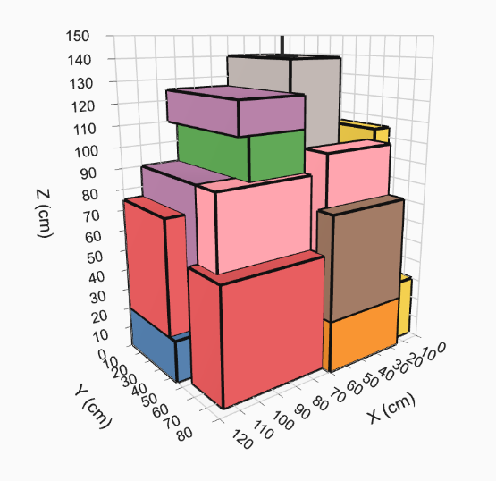

# 3D Bin Packing Problem (3DBPP)

An optimization pipeline for palletization using Genetic Algorithms and the Extreme Points heuristic.



## Pipeline

1. **Box Generation**: Procedurally generates box dimensions and spatial constraints.
2. **GA + Extreme Points Optimization**: Evolves packing sequences and box orientations to maximize pallet density and then places them bottom-up using the EP algorithm.
3. **Visualization**: Outputs 3D models, chronological animated sequences, and raw manifest definitions. See [demo](./palletization.html).

## Setup & Run

```bash
uv sync
uv run python src/main.py
```

## Outputs

- [palletization.html](./palletization.html): **A full interactive 3D animation of the packing process. Just double-click or open it in any web browser to view the step-by-step chronological drop sequence!**
- [placement.json](./placement.json): The raw chronological placement data (manifest).
